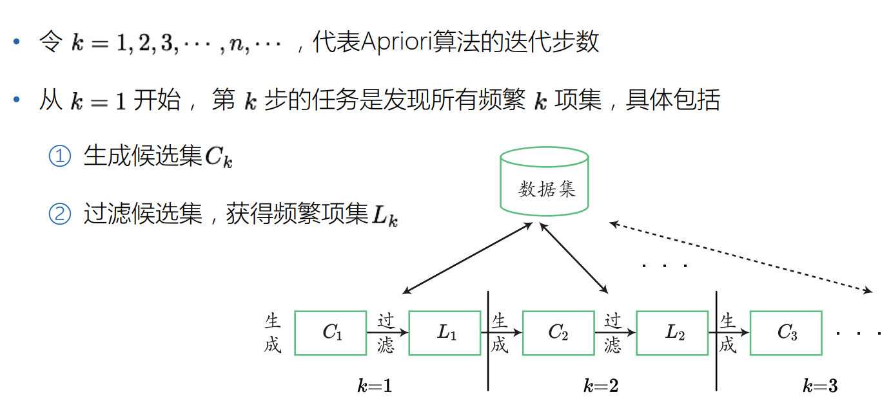
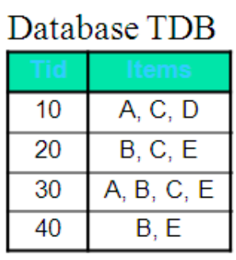
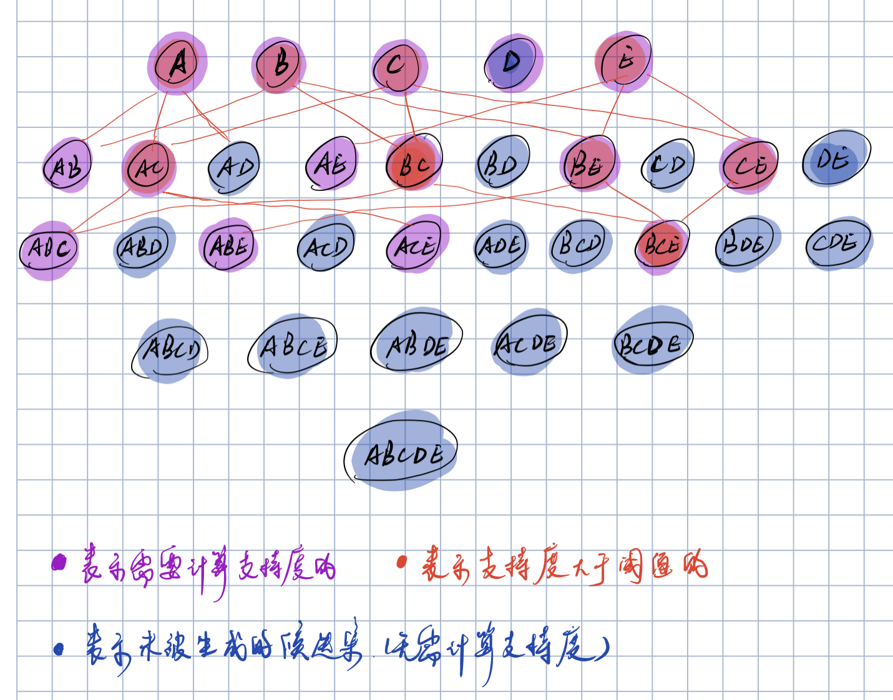
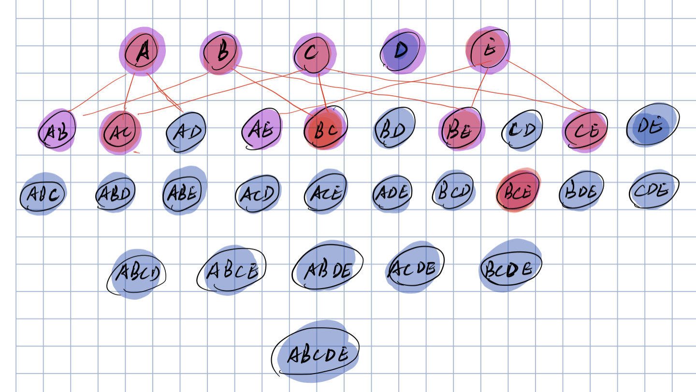
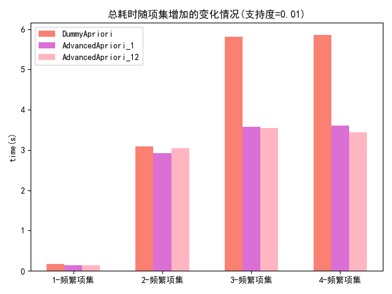

# 频繁模式和关联规则挖掘


## 一、实验说明

频繁模式和关联规则挖掘，考察对Apriori和FP-Growth算法的掌握程度。

### 任务描述

1. 在给定数据集上（10,000量级的数据）上使用关联规则挖掘算法。
2. 通过改变不同等级的支持度和置信度，比较Apriori，FP-Growth和baseline算法的性能
3. 试图根据Apriori或FP-Growth算法揭露出物品集相关性，发现一些有趣的关联规则。

### 数据集说明

此次实验，我们采用GroceryStore数据集，该数据集包含一个商店一个月的交易记录。数据集内容见Groceries.csv文件。其中，每一行包含一条交易记录，购买物品的列表在打括号“{}”里面，物品之间用逗号“，”分割；整体来看，共包含9835条交易记录，物品总数为169.


## 二、完成要求

### 实验基本要求

1. 数据处理：
   - [x] 能够load并对数据做适当的预处理 -15分
2. 算法实现：
   - [x] 手动实现 `dummy Apriori` 算法 -20分
   - [x] 手动实现 `advanced Apriori`算法的前两种剪枝策略 -20分
   - [x] 调用库`pyfpgrowth`实现`pyfpgrowth`算法 -10分

3. 算法应用

   - [x] 使用`Apriori`算法在GroceryStore数据集上挖掘3-项集（支持度0.01）-5分

   - [x] 使用`Apriori`算法在GroceryStore上挖掘关联规则（支持度0.01，置信度0.5）-5分

   - [x] 使用`FP-Growth`算法在GroceryStore数据集上挖掘一些关联规则（置信度0.5）-5分

   - [x] 算法效率分析，对比`dummy Apriori`、仅使用第一种剪枝策略`Advanced Apriori_1`、同时使用第一种和第二种剪枝策略`Advanced Apriori_12`的时间消耗，画图对比在支持度为0.01时，随着频繁项集项的增加，总耗时的变化情况。-5分

### 实验额外要求

- [x] 使用命令行接收参数（数据集，支持率，挖掘频繁项集的大小）-5分
- [x] 寻找两个关联规则，比较强的关联规则，进行市场分析。-5分
- [ ] 实现第三种剪枝策略，并将三种剪枝策略一起使用算法运行时间一起画在算法时间对比图表中。-10分
- [ ] 实验对比不同算法（`Dummy Apriori`、`Avanced Apriori_1`、`Advanced Apriori_12`、`Advanced Apriori_123`、`FP-Growth`）的内存使用情况，并画图分析。-10分


### 总计完成：105分


## 三、算法原理与分析

Apriori算法是常用的用于挖掘出数据关联规则的算法，它用来找出数据值中频繁出现的数据集合，找出这些集合的模式有助于我们做一些决策。核心思想：**首先产生候选集，然后验证候选集是否满足频繁的需求。**

Apriori算法的性质：**如果一个项集不是频繁项集，那么它的所有超集都不可能是频繁项集**。依据该性质，对于某（n+1）项集，只要存在一个n项子集不是频繁项集，则可以直接判定该项集不是频繁项集。算法流程如下图所示：



<center style="color:#C0C0C0;text-decoration:underline">图3.1 Apriori算法流程</center>

### Dummy Apriori 算法

Dummy Apriori算法没有进行剪枝的操作，它基于第k频繁项集的暴力搜索来产生k+1的候选集。



<center style="color:#C0C0C0;text-decoration:underline">图3.2 数据集</center>

以图3.2 的数据集为例，Dummy算法的流程如图3.3所示，总共需要计算的支持度的项集个数有（5+6+4）。



<center style="color:#C0C0C0;text-decoration:underline">图3.3 Dummy Apriori算法示例</center>


### Advanced Apriori_1 算法

Advanced Apriori_1 算法通过减小生成候选集的规模来加速搜索过程。如果一个k+1候选项是频繁的，那么生成它的k频繁项集中必包含其k+1个子集。还是以图3.2的数据集为例，Apriori_1的剪枝策略如下图3.4 所示，由于AB项集经过了支持度的验证判断为非频繁项集，那么可以确定其ABE、ABC均不是频繁项集，因此总共需要计算的支持度减小为（5+6+1）次。



<center style="color:#C0C0C0;text-decoration:underline">图3.4 Apriori_1算法示例</center>

### Advanced Apriori_2 算法

Advanced Apriori_2 算法通过减小事务表（数据记录表）的规模来加速搜索。如果一个k+1项候选项能够与事务表中的一条数据记录匹配，那么其k+1个子集也必能与事务表中该条记录匹配。因此在事务表中匹配k候选项项集的时候，统计每条记录被匹配的次数，如果少于k+1次，那么将该条记录从事务表中移除，因为他决不可能与下一轮的任一k+1候选项匹配。这样每次迭代都减小了事务表的规模，从而减小扫描事务表的时间消耗。

### Advanced Apriori_3 算法

如果事务表中元组的某一项能包含在一个k+1频繁项中，那么该项必出现在这个k+1频繁项的k个k项子集中。所以在扫描事务表统计k项候选集的出现频次时，如果事务表中任意元组的某一项未被匹配中k次，那么该项将在筛选出k频繁项集后从元组中出去，从而减小统计k+1项候选集频次时与事务表中元组的匹配事务。


## 四、实验结果与分析

基于Apriori开发的所有算法封装在Apriori的类中，其帮助文档如下：

```python
usage: Apriori [-h] [--file FILE] [--support SUPPORT] [--confidence CONFIDENCE] [-itemk ITEMK]

optional arguments:
  -h, --help            show this help message and exit
  --file FILE, -f FILE  dataset absolute/relative path
  --support SUPPORT, -s SUPPORT
                        min support for the frequency itemset
  --confidence CONFIDENCE, -c CONFIDENCE
                        min Confidence for the associate rule
  -itemk ITEMK, -k ITEMK
                        the size of frequent itemsets
```

### 4.1 挖掘频繁3-项集

在命令行中输入以下命令，即可输出频繁三项集的搜索结果及对应的关联规则与置信度。

```bash
python Apriori.py -f GroceryStore/Groceries.csv -s 0.01 -k 3
```

也可以加入置信度来过滤置信度：

```python
python Apriori.py -f GroceryStore/Groceries.csv -s 0.01 -c 0.5 -k 3
```

output：

```bash
Dummy Apriori complete in 6.77399s

----------------------------Items------------------------------
item: ('rolls', 'curd', 'buns'), 0.010
item: ('curd', 'yogurt', 'whole milk'), 0.010
item: ('sausage', 'fruit', 'vegetable juice'), 0.010
item: ('rolls', 'buns', 'frozen vegetables'), 0.010
item: ('butter', 'whipped', 'sour cream'), 0.010
...

----------------------------RULES------------------------------
Rule: ('yogurt', 'root vegetables') ==> ('other vegetables',) , 0.500
Rule: ('rolls', 'root vegetables') ==> ('other vegetables',) , 0.502
Rule: ('buns', 'root vegetables') ==> ('other vegetables',) , 0.502
Rule: ('whipped', 'other vegetables') ==> ('whole milk',) , 0.507
...
```


### 4.2 FP-Growth 算法挖掘关联规则

调用`Apriori.py`中的`callFPGrowth`即可使用FP-Growth来挖掘关联规则，输出如下：

```bash
FP Growth complete in 0.68050s
{('bags',): (('cling film',), 0.9655172413793104), ('cling film',): (('bags',), 1.0), ('packaged fruit',): (('vegetables',), 0.9921875), ('vegetables',): (('packaged fruit',), 0.9921875), ('blush wine',): (('red',), 0.9894179894179894), ('red',): (('blush wine',), 0.9894179894179894), ('buns', 'cream cheese '): (('rolls',), 1.0), ('cream cheese ', 'rolls'): (('buns',), 1.0), ('buns', 'frozen vegetables'): (('rolls',), 1.0), ('frozen vegetables', 'rolls'): (('buns',), 1.0), ('buns', 'chocolate'): (('rolls',), 1.0), ('chocolate', 'rolls'): (('buns',), 1.0),...
```


### 4.3 算法效率分析

支持度在0.01时，该数据集的最大频繁项集个数为3，因此仅讨论频繁项集项从1增加到3时，总耗时的变化情况。

调用`Apriori`类中的算法时效性分析函数`algorithmEfficiencyAnalysis()`，这里设置最大的频繁项集为4，程序会自动运行对应的三种算法并记录寻找k-频繁项集所用的时间，绘制成图像如图4.1所示。由图可以看出，随着支持度的增加，添加了剪枝策略的Apriori算法加速效果越明显。



<center style="color:#C0C0C0;text-decoration:underline">图4.1 总耗时随项集增加的变化情况</center>

### 4.4 关联规则分析

为了寻找强的关联规则，需要综合考虑支持度和置信度的大小。支持度保证了样本的数量，置信度显示了两者关联的大小。本实验按照支持度由大到小的顺序进行实验，当取支持度为0.04时，程序找到了两组如下所示，并且相关两组的置信度也非常高，说明了这2组商品具有强关联性

```bash
----------------------------Items------------------------------
item: ('other vegetables', 'rolls', 'buns'), 0.043
item: ('rolls', 'whole milk', 'buns'), 0.057

----------------------------RULES------------------------------
Rule: ('other vegetables', 'rolls') ==> ('buns',) , 1.000
Rule: ('other vegetables', 'buns') ==> ('rolls',) , 1.000
Rule: ('whole milk', 'rolls') ==> ('buns',) , 1.000
Rule: ('whole milk', 'buns') ==> ('rolls',) , 1.000
```

由此可见，全脂牛奶、卷纸、面包应该放在一起，其他蔬菜、卷纸、面包也应放在一起，这样可以有效的提高面包和卷纸的销售量。